# DRF for beginners

### What we shall cover

- Environment setup 
- Models and Custom user model 
- User Registration
- JWT authentication
- User Login
- Sending email
- User email verification
- Unittesting
- Viewsets and urls 
- Generic API Views 
- CORS and REST 
- Django templates and static setup 
- Pagination support 
- API documentation
- Postman documentation integration
- Project documentation views 
- Admin and models 
- Test coverage reporting 
- Github + Travis ci integration
- Deployment 

### Prerequisites

- Basic python concept

- OOP principles 

## Project Setup and Apps 

1. Python version 3 이상 설치

2. 가상환경 생성

    ```
    python -m venv venv 
    source venv/Scripts/activate
    ```

3. Django 설치

    ```
    pip install django==3.1.7 djangorestframework
    ```

4. app에 rest_framework 추가 

5. 앱 만들기 

    ```
    python manage.py startapp todos
    python manage.py startapp authentications
    ```

6. git ignore 생성

    https://www.toptal.com/developers/gitignore/

## Create a Tracking Model

- Django는 모델을 생성할 때마다 유사한 필드를 적용해야할 때가 있다.

- Tracking Model을 사용하여, 장고 모델의 객체가 생성되거나 업데이트 될 때 검색 방법을 통해 대부분의 항목이 어플리케이션에 공통적으로 적용된다.

- 장고는 생성된 각 모델에서 생성된 것과 같은 필드를 제공하지 않으므로 우리는 모델 helper를생성하여, 모델을 생성할 때 세부정보를 한 번에 빠르게 추가할 수 있는 helper를 생성한다.

#### 생성방법

- helpers라는 폴더를 생성하고 models.py 파일을 만든다

```python
class TrackingModel(models.Model) :
    # 객체가 생성된 시간에 맞게 생성됨 
    created_at = models.DateTimeField(auto_now_add=True)
    # 객체가 수정될 때 마다 시간이 갱신됨 
    updated_at = models.DateTimeField(auto_now=True)
    
    
    class Meta :
        abstract=True
        # 생성 시간을 역정렬해서 정렬함 
        ordering=('-created_at',)
```

- abstract=True 옵션
    - 부모 모델은 실제로 존재하지 않는 가상의 클래스가 된다.
    - 자식 모델은 부모 필드의 속성과 함수를 물려받는 실체가 있는 DB 테이블이 된다. 
    - abstract를 사용한다는 것은 자식 모델들이 부모 없이 각각 독립적인 DB 테이블로서 존재하며, 자식과 부모의 상속관계는 실제로 없는 것이다. 공통된 필드가 많이 있는 모델 클래스들이 있을 때 코드를 효율적으로 사용하기에 편리한 기능이다.
- ordering
    - 객체를 조건 내의 순서로 정렬할 수 있다.

## Django Custom User Model

- email을 username 대신 인증 수단으로 사용한다. 

- 이를 위해 BaseUser에서 필요한 기능들을 가져온다.

    - django.contrib.auth.models에서 AbstractUser을 복사한다.
    - email을 blank=False, unique=True로 설정한다

- usermanager

    - 객체가 생성되거나 검색되는 방식을 지정하는 클래스

    - 객체 생성 방식을 변경할 때마다 사용자 지정 관리자를 정의하고 메서드가 작동하는 방식을 변경해야 하므로 중요하게 이용될 수 있다.

```python
from datetime import timezone
from django.db import models

from helpers.models import TrackingModel
from django.contrib.auth.validators import UnicodeUsernameValidator
from django.contrib.auth.models import PermissionsMixin,AbstractBaseUser,UserManager
from django.utils.translation import gettext_lazy as _
from django.utils import timezone
# Create your models here.


# add new prooperites access_token, is_email_verified
# Use email and password instead of username/password

class MyUserManager(UserManager) : 
    use_in_migrations = True

    def _create_user(self, username, email, password, **extra_fields):
        """
        Create and save a user with the given username, email, and password.
        """
        # username 미입력시 
        if not username:
            raise ValueError('The given username must be set')
        #email 미입력시 
        if not email:
            raise ValueError('The given email must be set')
        
        # email 유효성 검사 
        email = self.normalize_email(email)
        username = self.model.normalize_username(username)
        user = self.model(username=username, email=email, **extra_fields)
        user.set_password(password)
        user.save(using=self._db)
        return user

    def create_user(self, username, email, password=None, **extra_fields):
        extra_fields.setdefault('is_staff', False)
        extra_fields.setdefault('is_superuser', False)
        return self._create_user(username, email, password, **extra_fields)

    def create_superuser(self, username, email, password=None, **extra_fields):
        extra_fields.setdefault('is_staff', True)
        extra_fields.setdefault('is_superuser', True)

        if extra_fields.get('is_staff') is not True:
            raise ValueError('Superuser must have is_staff=True.')
        if extra_fields.get('is_superuser') is not True:
            raise ValueError('Superuser must have is_superuser=True.')

        return self._create_user(username, email, password, **extra_fields)

   

class User(AbstractBaseUser, PermissionsMixin,TrackingModel) :
    """
    An abstract base class implementing a fully featured User model with
    admin-compliant permissions.

    Username and password are required. Other fields are optional.
    """
    
    # username에 대한 유효성 검사 
    username_validator = UnicodeUsernameValidator()

    # username은 char field 
    username = models.CharField(
        _('username'),
        max_length=150,
        unique=True,
        help_text=_('Required. 150 characters or fewer. Letters, digits and @/./+/-/_ only.'),
        validators=[username_validator],
        error_messages={
            'unique': _("A user with that username already exists."),
        },
    )

    email = models.EmailField(_('email address'), blank=False,unique=True)
    is_staff = models.BooleanField(
        _('staff status'),
        default=False,
        help_text=_('Designates whether the user can log into this admin site.'),
    )
    is_active = models.BooleanField(
        _('active'),
        default=True,
        help_text=_(
            'Designates whether this user should be treated as active. '
            'Unselect this instead of deleting accounts.'
        ),
    )
    date_joined = models.DateTimeField(_('date joined'), default=timezone.now)
    email_verified = models.BooleanField(
        _('email_verified'),
        default=False,
        help_text=_(
            'Designates whether this user email is verified  '
        ),
    )
    objects = MyUserManager()

    EMAIL_FIELD = 'email'
    #username 필드를 email로 선언하면 email을 기본 로그인 수단으로 이용할 수 있다.!! 
    USERNAME_FIELD = 'email'
    REQUIRED_FIELDS = ['username']
    
    @property
    def token(self) :
        return ''
        
```


## User Model Test

### Coverage

- coverage라는 패키지를 이용하면, 각 Django의 모델들을 모두 테스트하고 로그를 편안하게 볼 수 있다.

```
pip install coverage
```

```
coverage run manage.py test && coverage report && coverage html 
```

- test 
    - test코드를 진행한다
- report
    - test 결과를 표시한다
- html
    - html로 테스트 된 코드의 여부를 확인할 수 있다.

#### testcode

```python
from rest_framework.test import APITestCase
from authentication.models import User 

class TestModel(APITestCase) :
    
    def test_creates_user(self) :
        
        user=User.objects.create_user('test','test@gmail.com','password123!@#')
        
        self.assertIsInstance(user,User) 
        self.assertFalse(user.is_staff) 
        self.assertEqual(user.email,'test@gmail.com') 
    
    
    def test_creates_super_user(self) :
        
        user=User.objects.create_superuser('test','test@gmail.com','password123!@#')
        
        self.assertIsInstance(user,User) 
        self.assertTrue(user.is_staff) 
        self.assertEqual(user.email,'test@gmail.com') 
```

#### HTML 표시 화면 

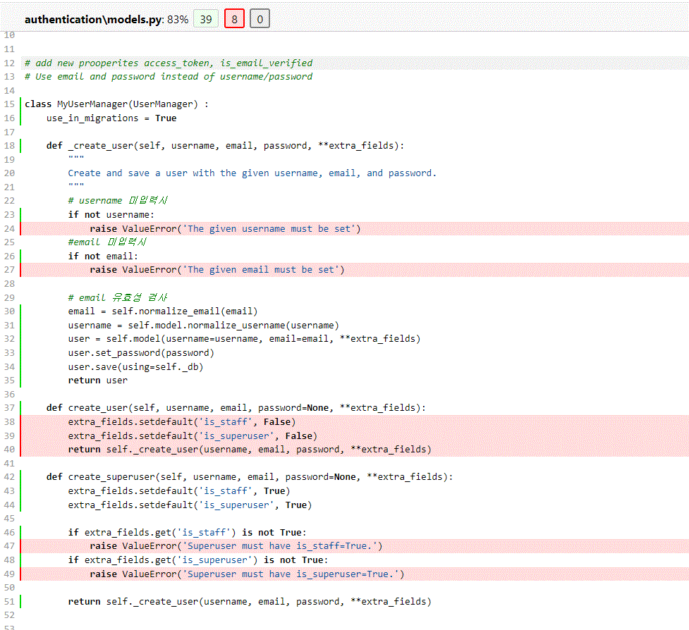

#### 최종 테스트 

```python
from rest_framework.test import APITestCase
from authentication.models import User 

class TestModel(APITestCase) :
    
    # 기본 유저 생성 
    def test_creates_user(self) :
        
        # 기본 유저 생성 
        user=User.objects.create_user('test','test@gmail.com','password123!@#')
        
        self.assertIsInstance(user,User) 
        # 기본 user가 staff가 아닌가? 
        self.assertFalse(user.is_staff)
        # 생성된 user의 email과 생성시 입력한 email이 일치하는가 
        self.assertEqual(user.email,'test@gmail.com') 
    
    # 슈퍼 유저 생성 
    def test_creates_super_user(self) :
        
        # 슈퍼 유저 생성 
        user=User.objects.create_superuser('test','test@gmail.com','password123!@#')
        
        # 생성된 이메일이 User model의 instance인가. 
        self.assertIsInstance(user,User) 
        # 생성된 객체가 staff가 맞는가 ? 
        self.assertTrue(user.is_staff) 
        # 생성된 user의 email과 생성시 입력한 email이 일치하는가 
        self.assertEqual(user.email,'test@gmail.com') 

    #username 미입력 오류 테스트 
    def test_raises_error_when_no_username_is_supplied(self) :
        self.assertRaises(ValueError,User.objects.create_superuser, username="",email='test@gmail.com',password='password123!@#')
        self.assertRaisesMessage(ValueError,'The given username must be set')
    
    
    def test_raises_error_with_message_when_no_username_is_supplied(self) :
        with self.assertRaisesMessage(ValueError,'The given username must be set') :
            User.objects.create_superuser(username='',email='test@gmail.com',password='password123!@#')
        
        
    
    def test_raises_error_when_no_email_is_supplied(self) :
        self.assertRaises(ValueError,User.objects.create_superuser, username="test",email='',password='password123!@#')
        
    def test_raises_error_with_message_when_no_email_is_supplied(self) :
        with self.assertRaisesMessage(ValueError,'The given email must be set') :
            User.objects.create_superuser(username='test',email='',password='password123!@#')
    
    
    def test_creates_super_user_with_staff_status(self) : 
        with self.assertRaisesMessage(ValueError,'Superuser must have is_staff=True.') :
            User.objects.create_superuser(username='test',email='test@naver.com',password='password123!@#',is_staff=False)
        
    
    def test_creates_super_user_with_super_user_status(self) : 
        with self.assertRaisesMessage(ValueError,'Superuser must have is_superuser=True.') :
            User.objects.create_superuser(username='test',email='test@naver.com',password='password123!@#',is_superuser=False)

```

#### coverage 결과

authentication\admin.py        3      0   100%
authentication\apps.py         3      3     0%
authentication\models.py      47      1    98%
authentication\views.py        1      1     0%
todos\admin.py                 1      0   100%
todos\apps.py                  3      3     0%
todos\models.py                1      0   100%
todos\tests.py                 1      0   100%
todos\views.py                 1      1     0%


## User Registration (Email/Password)

### Class Based View

- 클래스 기반으로 View 함수를 작성하는 것

#### 왜 CBV를 사용하는가?

- Django의 많은 기능을 상속할 수 있기 때문

### GenericAPIView

- DRF에서는 GenericAPIView에 CreateModelMixin,ListModelMixin 등 다양한 클래스를 결합해 APIView를 구현한다.
- GenericAPIView는 CRUD에서 공통적으로 사용되는 다양한 속성을 제공하고, Mixin은 CRUD에서 특정 기능을 수행하는 메소드를 제공한다.
- DRF에서는 GenericAPIView와 Mixin으로 대부분 API View를 구성하지만, 상황과 모델, 요청에 따라 메소드를 Override 해서 커스텀을 진행한다. 

### Register

```python
class RegisterAPIView(GenericAPIView) :
    
    
    serializer_class=RegisterSerializer 
    
    
    def post(self,request) :
        serializers = self.serializer_class(data=request.data)  
        
        if serializers.is_valid() :
            serializers.save()
            return response.Response(serializers.data,status=status.HTTP_201_CREATED)
        return response.Response(serializers.errors,status=status.HTTP_400_BAD_REQUEST)
```

- serializer_class 
    - 요청을 받은 값에 대해 직렬화를 진행하며, 유효성 평가를 할 수 있는 클래스를 지정한다.
    - serializer는 보통 개발자의 의도에 따라 Model에 맞추어 등록하고, 요청을 받을 Model을 대상으로 직렬화 class를 만든다. 

### Serializer

- 사용자가 우리 프로그램에  json 데이터를 보낼 때 이를 파이썬 네이티브 객체로 바꾸는 역할을 한다.

- 왜냐하면 사용자가 JSON 데이터를 보낼 때 모델 객체처럼 매핑을 해야하기 때문 

- 이것을 연결하는데 도움을 주는 것이 serializer이다. 

- 또한 이를 python 객체를 json으로 변환하여 유저에게 제공한다.  

```python
class RegisterSerializer(serializers.ModelSerializer) :
    
    password = serializers.CharField(max_length=128,min_length=6,write_only=True)
	#password를 write_only로 설정하여, API 결과로는 보이지 않게 할 수 있다 .    
    class Meta() :
        model=User
        fields = ('username','email','password',)
        
    
    def create(create,validated_data) :
        
        return User.objects.create_user(**validated_data)
```

## Authenticate a user. Get JWT Access Token. 

#### Views.py

```python

#토큰으로 인증된 유저 정보 가져오기 
class AuthUserAPIView(GenericAPIView) :
    
    permission_classes=(permissions.IsAuthenticated,)
    def get(self,request) :
        # print(request.user)

        user = request.user
        serializers=RegisterSerializer(user)
        
        return response.Response({'user':serializers.data})
    
class LoginAPIView(GenericAPIView) :
    authentication_classes=[]
    serializer_class = LoginSerializer
    def post(self,request) :
        email = request.data.get('email',None)
        password = request.data.get('password',None)
        
        user = authenticate(username=email,password=password)
        
        if user :
            
            serializer =  self.serializer_class(user)
            
            return response.Response(serializer.data,status=status.HTTP_200_OK)
        return response.Response({'message':"Invaild credentials,try again"},status=status.HTTP_401_UNAUTHORIZED)
```


### JWT

```python
from rest_framework.authentication import get_authorization_header,BaseAuthentication
from rest_framework import exceptions
import jwt
from django.conf import settings

from authentication.models import User

class JWTAuthentications(BaseAuthentication) :
    
    def authenticate(self, request):
        print(request.data)
        #요청에서 header를 가져온다. 
        auth_header = get_authorization_header(request)
        print(auth_header)
        #받은 header를 utf-8로 디코딩한다. 
        auth_data = auth_header.decode('utf-8')
        print(auth_data)
        #token 형식이 Bearer + Token 이므로, ' '로 나눈다. 
        auth_token = auth_data.split(' ')
        print(auth_token)
        
        #토큰이 있는 리스트 길이가 2여야 하는데, 그렇지 않으면 유효하지 않은 토큰 
        if len(auth_token)!=2 :
            raise exceptions.AuthenticationFailed('Token not valid')
        
        #토큰만 취한다. 
        token=auth_token[1]
        
        try:
            #토큰과 SECRET_KEY, 발급시 사용한 알고리즘을 이용해서 디코딩한다. 
            payload=jwt.decode(token,settings.SECRET_KEY,algorithms='HS256')
            print(payload)
            #디코딩 결과로 얻은 username으로 유저 정보를 가져온다. 
            username=payload['username']
            
            
            user=User.objects.get(username=username)
            
            return (user,token)
            
        #만료된 토큰일경우 예외처리 
        except jwt.ExpiredSignatureError as ex:
            raise exceptions.AuthenticationFailed('Token is expired, login again')
        
        #디코딩 에러일 경우 예외처리 
        except jwt.DecodeError as ex:
            raise exceptions.AuthenticationFailed('Token is invalid')
        
        #토큰 정보로 가져온 User가 존재하지 않을 경우 예외처리 
        except User.DoesNotExist as no_user:
            raise exceptions.AuthenticationFailed(
                'No Search user'
            )
        
        
        return super().authenticate(request)
```

### settings.py

```python
REST_FRAMEWORK = {
    'DEFAULT_AUTHENTICATION_CLASSES': [
        'authentication.jwt.JWTAuthentications',
    ]
}
```

#### API 요청 결과

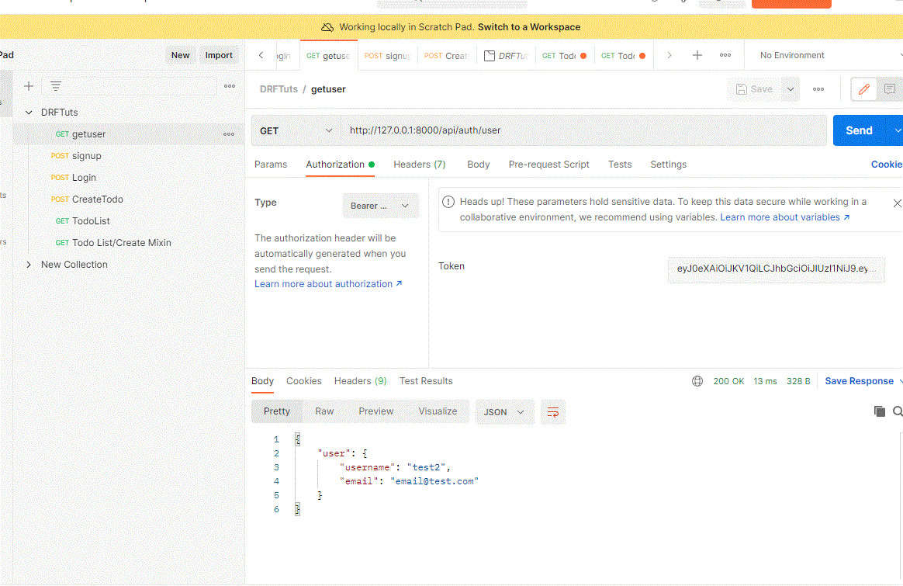

## List/Create API View

- APIView를 상속받아 간단히, 게시글을 작성하고 조회할 수 있다.

### Model

```python
class Todo(TrackingModel) :
    
    title = models.CharField(max_length=255)
    desc = models.TextField()
    is_complete = models.BooleanField(default=False)
    owner = models.ForeignKey(to=User,on_delete=models.CASCADE)
    
    def __str__(self) :
        return self.title
```

- is_complete는 Todo를 만들 때 기본적으로 False로 설정해, Todo를 생성 시 기본적으로 끝나지 않은 상태로 등록한다.
- Todo의 주인은 Todo를 생성한 User를 참조해서 등록한다. 

### Serializer

```python
class TodoSerializer(ModelSerializer) :
    
    class Meta:
        model=Todo
        
        fields = ('title','desc','is_complete',)
```

- is_complete 는 default 값이 있기 때문에, title과 desc를 입력받게 하고, 직렬화 필드를 거치면, 해당 3가지 필드를 serializer에 담아서 응답을 보낸다. 

### Create

```python
class CreateTodoAPIView(CreateAPIView) :
    
    serializer_class =TodoSerializer
    permission_classes=(IsAuthenticated,)
    
    def perform_create(self, serializer):
        return serializer.save(owner=self.request.user)
```

- CreateAPIView는 mixins.CreateModelMixin과 GenericAPIView를 상속받는다.

```python
# CreateAPIView
class CreateAPIView(mixins.CreateModelMixin,
                    GenericAPIView):
    """
    Concrete view for creating a model instance.
    """
    def post(self, request, *args, **kwargs):
        return self.create(request, *args, **kwargs)
    
#mixins.CreateModelMixin
class CreateModelMixin:
    def create(self, request, *args, **kwargs):
        serializer = self.get_serializer(data=request.data)
        serializer.is_valid(raise_exception=True)
        self.perform_create(serializer)
        headers = self.get_success_headers(serializer.data)
        return Response(serializer.data, status=status.HTTP_201_CREATED, headers=headers)

    def perform_create(self, serializer):
        serializer.save()

    def get_success_headers(self, data):
        try:
            return {'Location': str(data[api_settings.URL_FIELD_NAME])}
        except (TypeError, KeyError):
            return {}
```

- 데이터가 POST 요청으로 들어오면, serializer 필드에 요청된 데이터를 넣고, 모델에 새로운 Instance를 추가한다. 
- post 요청을 받으면, 넘어온 데이터로 create를 진행한다.
- create는 CreateModelMixin class에서 상속받는데, serializer_classs에서 선언한 직렬화기로, 직렬화를 진행한다.
- 유효성 검사를 끝내면 perform_create 함수에 직렬화가 끝낸 정보를 넣어주는데, 이를 custom 하여, 요청한 user를 owner로 선언해준다. 

### List

```python
class TodoListAPIView(ListAPIView) :
    
    serializer_class = TodoSerializer
    permission_classes=(IsAuthenticated,)
    
    
    queryset=Todo.objects.all()
    
    
    def get_queryset(self):
        return Todo.objects.filter(owner=self.request.user)
```

- List API View는 get 요청에 대해 queryset 형태로 데이터를 리턴하는 클래스이다.

- 해당 클래스에는 필수적으로 queryset을 정의해야 하며, 이를 정의하면 다른 override 없이 queryset을 리턴한다.

    - ```python
        class TodoListAPIView(ListAPIView) :
         
            serializer_class = TodoSerializer
            queryset=Todo.objects.all()
        ```

- 하지만 queryset에 대해서 custom하여 request에 담긴 data를 가지고 오고 싶은 경우 get_queryset 함수를 재정의 하여 해결할 수 있다.

    - ```python
        class TodoListAPIView(ListAPIView) :
            
            serializer_class = TodoSerializer
            def get_queryset(self):
                return Todo.objects.filter(owner=self.request.user)
        ```

- 해당 TodoListAPIView의 경우 get_queryset을 재정의 했기 때문에, queryset을 요청하지 않아도 되며, queryset 요청에 대해 요청한 유저가 작성한 유저인 경우에만 불러온다. 

- 일반적으로 queryset을 사용하여 보다 깔끔히 표시하지만, **request에서 data를 가져와야 할 경우에는 필수적으로 get_queryset을 사용**해야한다.

#### Stackoverflow 참고 글 

https://stackoverflow.com/questions/19707237/use-get-queryset-method-or-set-queryset-variable

- `queryset`서버를 시작할 때 쿼리 세트가 한 번만 생성되며, 반면 `get_queryset`에 모든 요청에 대해 메서드가 호출된다.

    - 유용한 또 다른 예 `get_queryset`는 콜러블을 기반으로 필터링하려는 경우입니다. 예를 들어 오늘의 투표를 반환합니다.

        ```python
        class IndexView(generic.ListView):
            def get_queryset(self):
                """Returns Polls that were created today"""
                return Poll.active.filter(pub_date=date.today())
        ```

        queryset를 설정하여 동일한 작업을 시도 하면 뷰가 로드될 때 `queryset`의 `date.today()`가 한 번만 호출되고 잠시 후 뷰가 잘못된 결과를 표시합니다.

        ```haskell
        class IndexView(generic.ListView):
            # don't do this!
            queryset = Poll.active.filter(pub_date=date.today())
        ```

### ListCreateAPIView

- List와 Create 기능을 한 번에 이용할 수 있는 API View이다.

```python
class TodosAPIView(ListCreateAPIView) :
    serializer_class =TodoSerializer
    permission_classes=(IsAuthenticated,)
    def perform_create(self, serializer):
        return serializer.save(owner=self.request.user)
    # queryset=Todo.objects.all()
    def get_queryset(self):
        return Todo.objects.filter(owner=self.request.user)
```

### RetrieveUpdateDestroyAPIView

- get,put,delete,patch를 이용할 수 있다.
- lookup_field를 이용해 객체를 찾을 변수를 설정하고 url에서 요청받아, detail을 조회할 수 있다.

```python
class TodoDetailAPIView(RetrieveUpdateDestroyAPIView) :
    serializer_class =TodoSerializer
    permission_classes=(IsAuthenticated,)
    
    lookup_field="id"
    
    def get_queryset(self):
        return Todo.objects.filter(owner=self.request.user)
```

#### RetrieveUpdateDestroyAPIView

```python
class RetrieveUpdateDestroyAPIView(mixins.RetrieveModelMixin,
                                   mixins.UpdateModelMixin,
                                   mixins.DestroyModelMixin,
                                   GenericAPIView):
    """
    Concrete view for retrieving, updating or deleting a model instance.
    """
    def get(self, request, *args, **kwargs):
        return self.retrieve(request, *args, **kwargs)

    def put(self, request, *args, **kwargs):
        return self.update(request, *args, **kwargs)

    def patch(self, request, *args, **kwargs):
        return self.partial_update(request, *args, **kwargs)

    def delete(self, request, *args, **kwargs):
        return self.destroy(request, *args, **kwargs)
```


## Filtering, Searching, and Ordering. 

### Django filter

- 백엔드를 통해 데이터를 필터링 할 수 있는 다양한 방법을 제공하는 유연한 라이브러리
    - 정규식, 일치 정보, 텍스트 등 

```
pip install django_filters
```

#### Settings.py

```python
INSTALLED_APPS = [
    ...
    #3-rd party
    'django_filters',
    ...
]
```

#### Views.py

```python
#todos/views.py
from django_filters.rest_framework import DjangoFilterBackend
class TodosAPIView(ListCreateAPIView) :
    serializer_class =TodoSerializer
    permission_classes=(IsAuthenticated,)
    filter_backends=[DjangoFilterBackend,filters.SearchFilter,
                    filters.OrderingFilter]
    
    filterset_fields = ['id','title','desc','is_complete']
    search_fields = ['id','title','desc','is_complete']
    ordering_fields = ['id','title','desc','is_complete']
    
    
    def perform_create(self, serializer):
        return serializer.save(owner=self.request.user)
    # queryset=Todo.objects.all()
    def get_queryset(self):
        return Todo.objects.filter(owner=self.request.user)
```

### filter 이용하기

#### filterset_fields 

- filterset_fields에 정의된 필드들을 쿼리문 형태로 url에 입력하여 정확히 일치하는 값을 찾을 수 있다.
    - http://127.0.0.1:8000/api/todos?\<fields>=\<answer>

- 제목이 title인 것으로 검색
    - 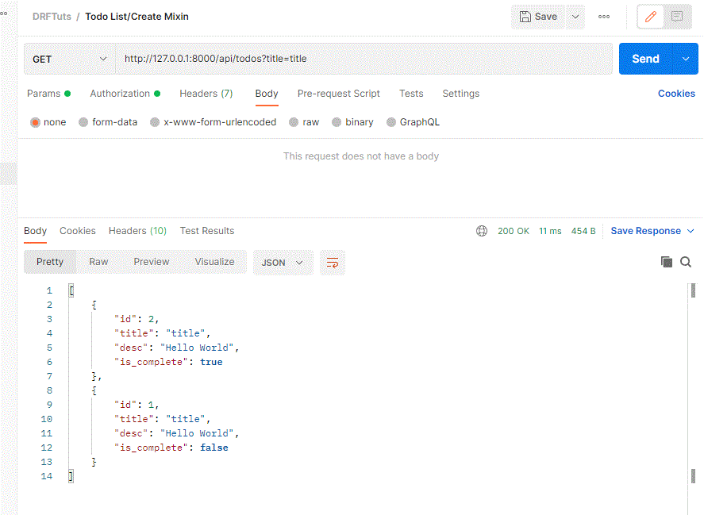
- 제목이 title3인 것으로 검색
    - 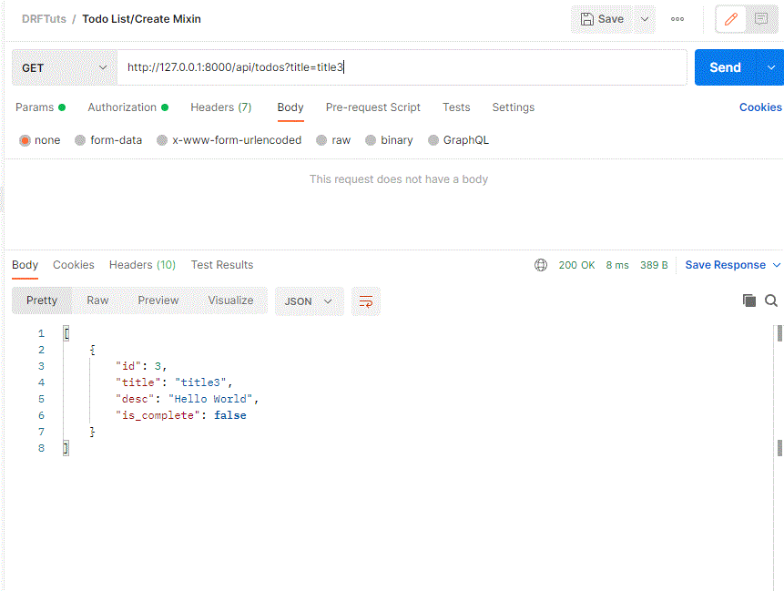
- Id가 1인 것으로 검색
    - 
- 완료한 항목 검색
    - 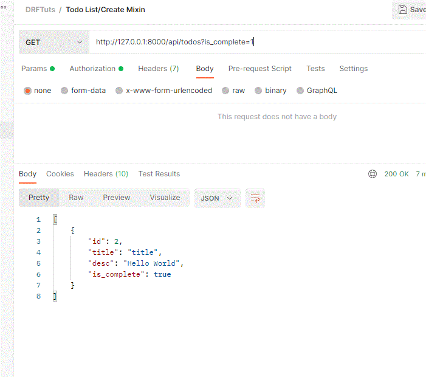

#### search_fields 

search_fields에 정의된 필드들을 쿼리문 형태로 url에 입력하여 원하는 정보가 포함된 데이터를 얻을 수 있다.

- http://127.0.0.1:8000/api/todos?\<fields>=\<answer>

- title로 검색

    - title이 들어간 모든 객체들이 검색된다. 

    - 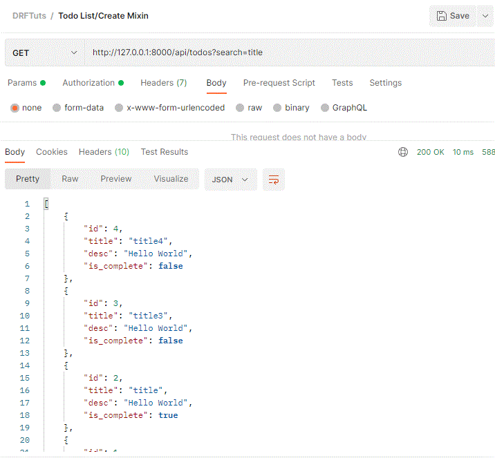

- 1로 검색
    - is_complete가 true이면 1로 인식하기 때문에, true인 값과 id가 1인 값이 나온다. 
    - 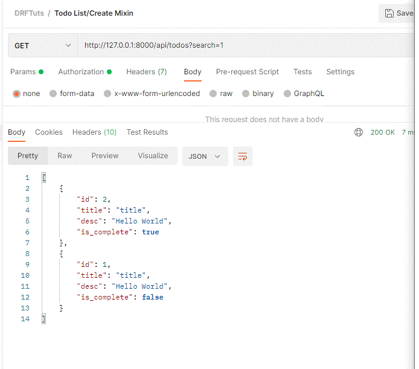

- 0으로 검색
    - is_complete가 false이면 0으로 인식되기 때문에 객체 자체에 0이란 값이 없지만, 해당 객체들이 조회된다. 
    - 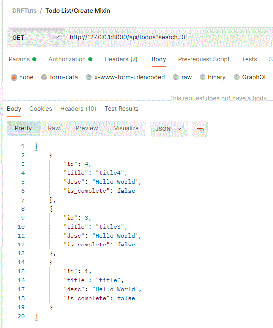

#### ordering_fields

- ordering_fields에 정의된 필드들을 쿼리문 형태로 url에 입력하여 순차적으로 출력할 수 있다.
- 제목 순서로 조회
    - 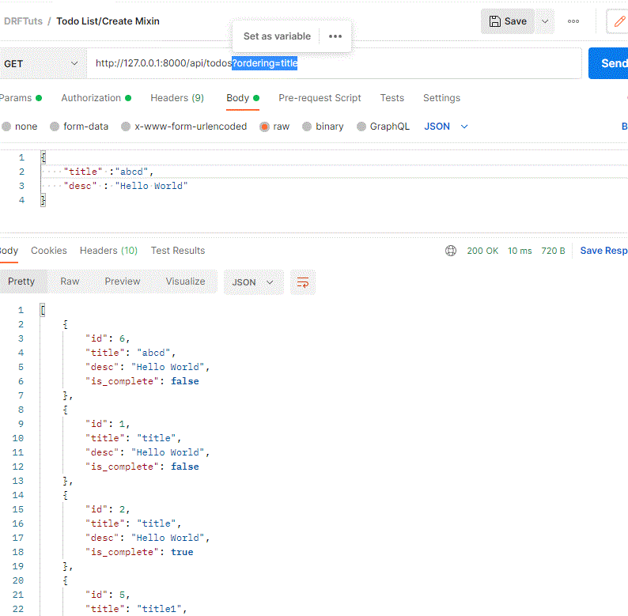

- is_complete로 조회
    - 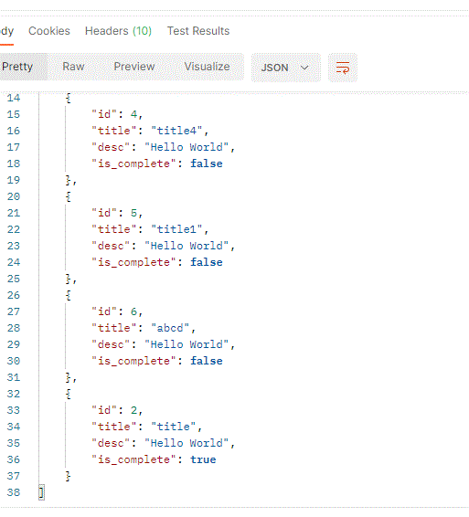

## Pagination

- 한정된 네트워크 자원을 효율적으로 활용하기 위해 쿼리의 결과값으로 리턴된 리소스를 분할하여 전달 하는 것을 의미한다.
- 콘텐츠를 여러 페이지로 나누고, 이전 혹은 다음 페이지로 넘어가거나 특정 페이지로 넘어갈 수 있게한다.

### LimitOffsetPagination

- Limit과 Offset을 이용해서, pagination을 진행하는 방식으로 **limit**은 한 페이지에 보여줄 객체의 수를 의미하고, **offset**은 몇 번 인덱스의 레코드를 보여줄 것인지 결정하는 파라미터이다. 
- offset 번째 레코드부터 

#### Default setting

```python

REST_FRAMEWORK = {
    'DEFAULT_AUTHENTICATION_CLASSES': [
        'authentication.jwt.JWTAuthentications',
    ],
    'DEFAULT_PAGINATION_CLASS':'rest_framework.pagination.LimitOffsetPagination',

}
```

- settings.py에서 해당 코드를 추가하면 간단히 Limit-Offset Pagination을 구현할 수 잇다.

- LImit=2,offset=1 일 경우 2번째 인덱스부터 2개씩 보여준다.
    - 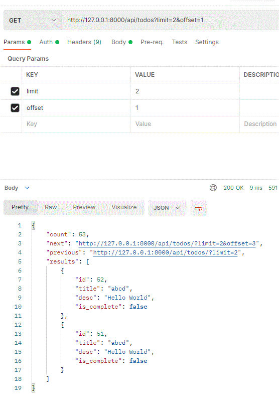

- limit=2,offset=2일 경우 3번째 인덱스부터 2개씩 보여준다.

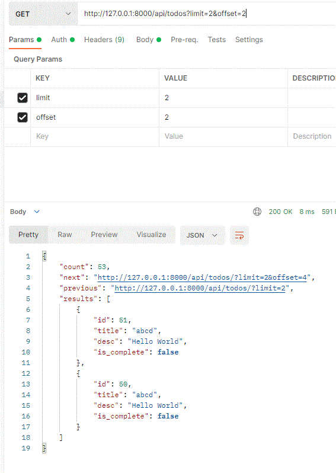

#### PageNumberPagination

- page : 몇 번째 페이지인지 표시해줍니다. 페이지는 1부터 시작한다.
- page_size : 한 페이지에 몇 개의 레코드를 보여줄지 표시한다.
- count  : 몇개의 레코드를 보여줄 것인지 count 파라미터로 설정할 수 있다.

#### Default settings

- settings.py에서 기본 Pagination option을 지정할 수 있으며, 글로벌하게 적용된다. 

```python
REST_FRAMEWORK = {
    'DEFAULT_AUTHENTICATION_CLASSES': [
        'authentication.jwt.JWTAuthentications',
    ],
    #PageNumberPagination
    'DEFAULT_PAGINATION_CLASS':'rest_framework.pagination.PageNumberPagination',
    #한 페이지에 보여줄 레코드의 수 
    'PAGE_SIZE':6
}
```

- 1페이지 검색
    - 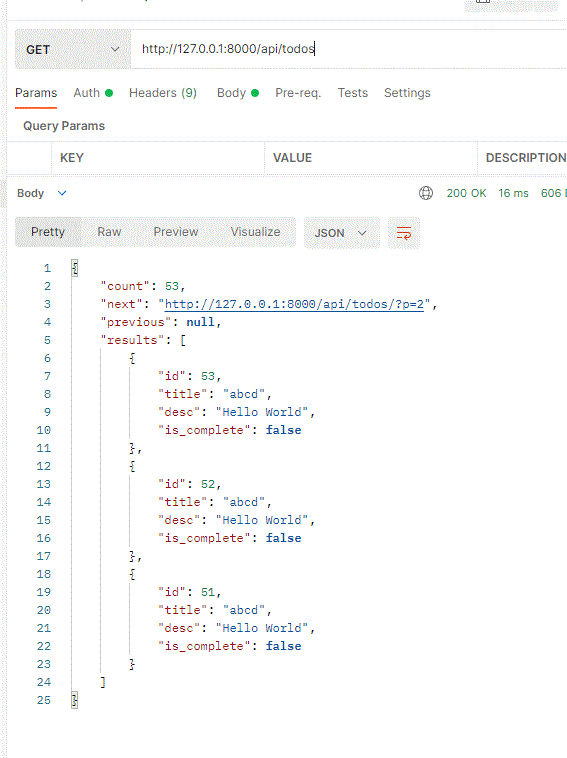
- 2페이지 검색
    - 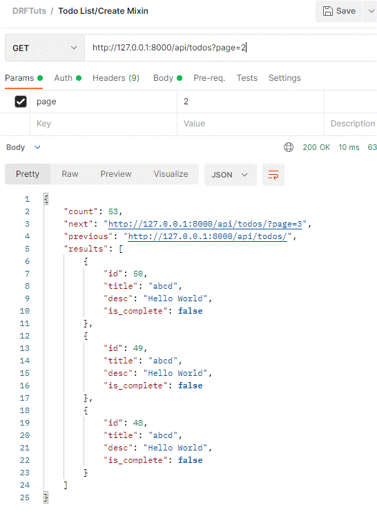

#### CustomPagination

- 페이지네이션을 할 때, 글로벌 옵션을 사용하지 않고, 각 View에 따라, 다른 옵션을 설정하고 싶다면 커스터마이징을 할 수 있다.

```python
#pagination.py
from rest_framework import pagination

class CustomPageNumberPagination(pagination.PageNumberPagination) :
    
    page_size=3
    page_size_query_param='count'
    max_page_size=5
    page_query_param='p'
    
    
#views.py

from todos.pagination import CustomPageNumberPagination

class TodosAPIView(ListCreateAPIView) :
    serializer_class =TodoSerializer
    pagination_class = CustomPageNumberPagination
  
    def get_queryset(self):
        return Todo.objects.filter(owner=self.request.user)
```

- page_size: 한 페이지에 보여줄 레코드의 수
- page_size_query_param : 파라미터에 count 수를 입력하여 몇 개의 레코드를 보여줄것인지 추가로 요청을 하게 도와준다.
- max_page_size : count로 요청 시 너무 많은 레코드를 요청하지 못하게 제한한다. 
    - 10개를 요청해도 5개만 준다.
- page_query_param : 'page' 파라미터로 페이지의 번호를 요청해야하는데, 이를 p로 단축하게 도와준다.

- page_query_param으로 요청하기
    - 기본 파라키터 'page'가 아닌 p로 요청할 수 있다. 
    - 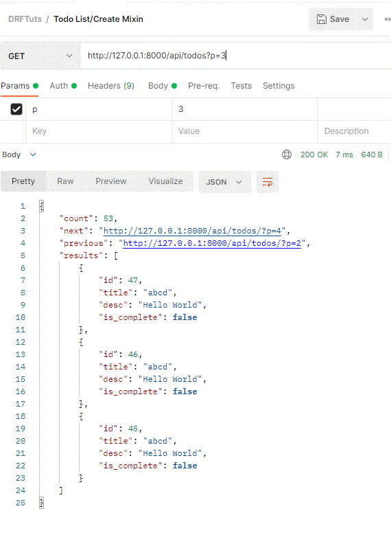
- count를 명시하고 요청하기
    - 기본 3개가 아닌 원하는 count로 레코드를 요청할 수 있다.
    - 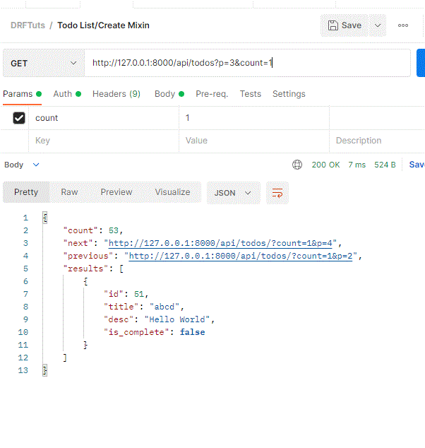
- max_page_size 이상으로 요청하기
    - 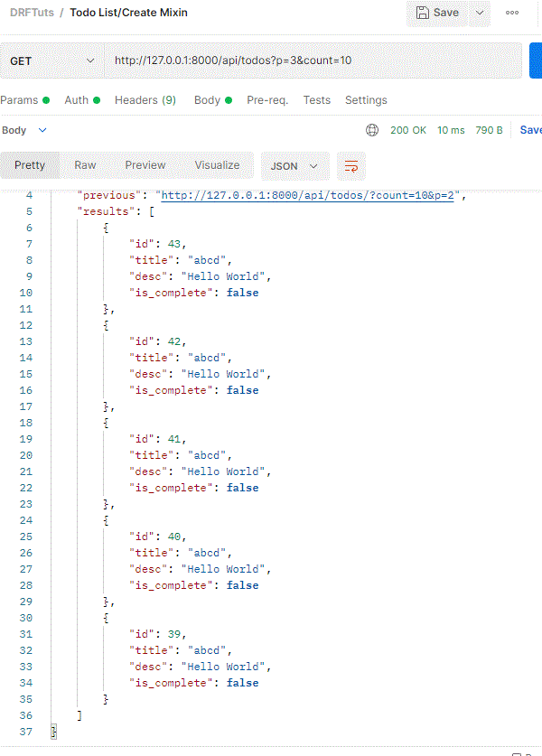


## API TEST

### Base Test code

- python은 똑같은 코드를 반복적으로 입력하려 결과를 얻는 것보다는 캡슐화를 통해 재사용성을 높이는 것을 선호한다.
- 따라서, 인증, data생성 같은 반복 작업에 대해 먼저 캡슐화를 진행한다. 

```python
class TodosAPITestCase(APITestCase) :
    #todo 생성하기 
    def create_todo(self) :
        #title과 desc를 입력
        sample_todo={'title':"Hello","desc":"Test"}
        #todo를 생성하기 
        response = self.client.post(reverse('todos'),sample_todo)
        #생성후 반환받은 값을 response로 return 하기 
        return response
        
    #인증 
    def authenticate(self) :
        #회원가입 
        self.client.post(reverse("register"),{'username':"username",'password':'password','email':'email@gmail.com'})
        #login 후 받은 toekn을 response에 저장 
        response=self.client.post(reverse('login'),{'username':"username",'password':'password','email':'email@gmail.com'})
        #token을 이용한 인증 진행하기 
        self.client.credentials(HTTP_AUTHORIZATION=f"Bearer {response.data['token']}")
```

### ListCreate Test

- ListCreate Veiw에 대해서 Create와 Read의  다양한 경우를 Test한다. 

```python
class TestListCreateTodos(TodosAPITestCase) :
    #인증되지 않은 사용자의 todo 작성 
    def test_should_not_creates_todo_with_no_auth(self) :
        response = self.create_todo()
        # 인증되지 않았기 때문에 403 에러를 반환
        self.assertEqual(response.status_code,status.HTTP_403_FORBIDDEN)

    
    #
    def test_should_create_todo(self) :
        #현재 데이터베이스의 Todo 객체의 개수 가져오기 
        previous_todo_count = Todo.objects.all().count()
        #인증하기 
        self.authenticate()
        #todo 만들고 return을 response에 저장하기 
        # sample_todo={'title':"Hello","desc":"Test"}
        response = self.create_todo()
        
        # 게시글이 생성되었으면, previous_todo_count에서 1을 더한 값과 일치할 것이다. 
        self.assertEqual(Todo.objects.all().count(),previous_todo_count+1)
        #HTTP 응답은 201을 반환할 것이다. 
        self.assertEqual(response.status_code,status.HTTP_201_CREATED)
        #title은 우리가 test한 'Hello'일 것이다. 
        self.assertEqual(response.data['title'],'Hello')
        #desc는 우리가 test한 'Test일' 것이다. 
        self.assertEqual(response.data['desc'],'Test')
        
        
    #todo 데이터 가져오기 
    def test_retrieves_all_todos(self) :
        #인증 
        self.authenticate()
        #모든 tood 데이터 가져오기 
        response= self.client.get(reverse('todos'))
        #HTTP응답은 인증 후 올바르게 코드를 넣었으면 200을 반환할 것이다. 
        self.assertEqual(response.status_code,status.HTTP_200_OK)
        #전달받은 instance는 list일 것이다. 
        self.assertIsInstance(response.data['results'],list)

        #새로운 데이터 생성하기 
        self.create_todo()
        #모든 todo 데이터 가져오기 
        res=self.client.get(reverse('todos'))
        #pagination 기능을 사용했기 때문에, reutnr의 count 값이 있을 것이며 이는 integer일 것이다. 
        self.assertIsInstance(res.data['count'],int)
        #해당 값은 1일 것이다. 
        self.assertEqual(res.data['count'],1)
```


### TodoDetail TEST

- Todo 단일 객체에 대해서 Read, Delete, Update를 테스트한다. 

```python
class TestTodoDetailAPIView(TodosAPITestCase) :
    #단일 객체 조회하기 
    def test_retrives_one_item(self) :
        
        #인증하기 
        self.authenticate()
        
        #todo 생성하기 
        response=self.create_todo()
        
        #생성한 todo의 id 값으로 조회하기 
        res = self.client.get(
                reverse('todo',kwargs={'id':response.data['id']}))
        #조회가 잘되면 200  반환 
        self.assertEqual(res.status_code,status.HTTP_200_OK)
        
        #생성한 id 값으로 todo 객체 가져오기 
        todo = Todo.objects.get(id=response.data['id'])
        
        #가져온 객체의 title이 조회한 todo의 title과 같은지 확인하기 
        self.assertEqual(todo.title,res.data['title'])
        
    #todo 수정 
    def test_updates_one_item(self) :
        #인증하기 
        self.authenticate()
        
        #todo 생성하기 
        response=self.create_todo()
        # print(response.data)
        
        #생성한 todo를 수정하기 
        res =self.client.patch(reverse('todo',
                                       kwargs={'id':response.data['id']}),
                                        {"title":"New one",'is_complete':True})
        
        #수정이 잘 되면 200 반환 
        self.assertEqual(res.status_code,status.HTTP_200_OK)
        #수정한 todo를 가져오기 
        updated_todo = Todo.objects.get(id=response.data['id'])
        # print(updated_todo.title)
        #수정결과와 일치하는지 확인하기 
        self.assertEqual(updated_todo.is_complete,True)
        self.assertEqual(updated_todo.title,"New one")
    
    #todo 삭제 
    def test_deletes_one_item(self) :
        #이
        self.authenticate()
        #todo 만들기 
        res =  self.create_todo()
        
        #현재 todo 개수 세기 (1개 )
        prev_db_count=Todo.objects.all().count()
        
        #현재 todo개수가, 0보다 큰가?
        self.assertGreater(prev_db_count,0)
        #현재 todo개수가 1개인가? 
        self.assertEqual(prev_db_count,1)
        
        #삭제요청 보내기 
        response = self.client.delete(
            reverse("todo",kwargs={'id':res.data['id']})
        )
        
        #삭제가 되었으면 204 반환 
        self.assertEqual(response.status_code,status.HTTP_204_NO_CONTENT)
        #현재 todo개수가 0개인가?
        self.assertEqual(Todo.objects.all().count(),0)
```

